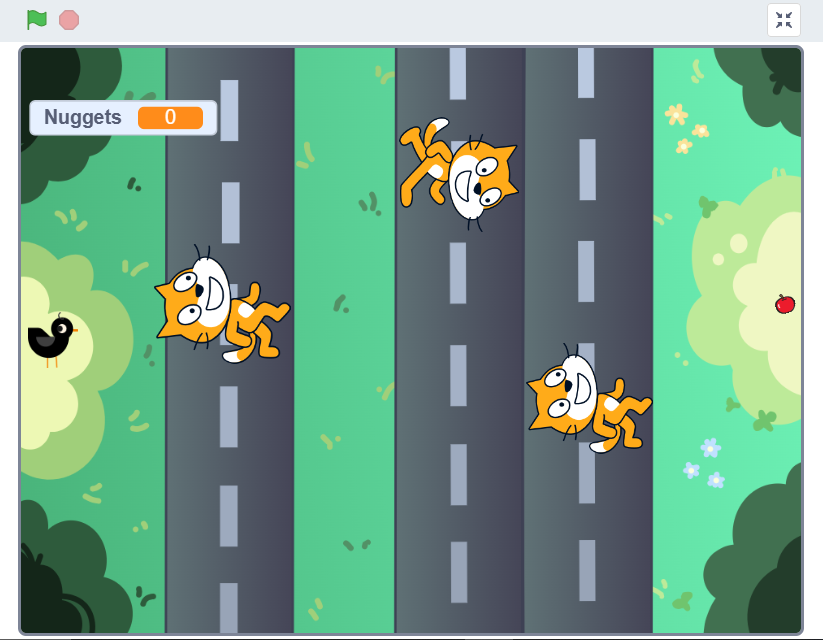

# Week 0 – Scratch ᓚᘏᗢ  
This folder contains my project for **Week 0 (Scratch)**.  

## Project Description  
The goal of this assignment was to create a short game using [Scratch](https://scratch.mit.edu/), a block-based programming language designed to make code more accessible and friendly towards beginners, mainly as a way of introducing programming logic visually.  

For my project, I created a very simplified version of the game Frogger, using **loops, conditionals, and variables** to make it run as expected.  

## How to Run and Play ▷  
1. Download the file **`chickeen.sb3`** from this folder.
2. Go to the [Scratch Projects Editor](https://scratch.mit.edu/projects/editor/).
3. Click on **File > Load from your computer** and select **`chickeen.sb3`**.
4. Click the green flag ▸ to start the project.
5. Use the keyboard arrows to walk.

## Preview ⛶  

  

(Screenshot of my Scratch project).  

## Online Version ⌕  
You can also view/play the project directly on Scratch:  
⤷ [Scratch Project](https://scratch.mit.edu/projects/1208053742/)  

## End results ⋆
- Introduction to programming logic using blocks.
- Understanding of conditions, loops, and basic algorithms.
